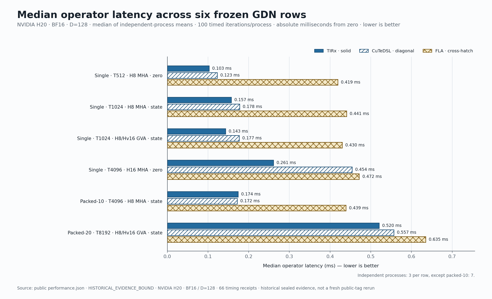
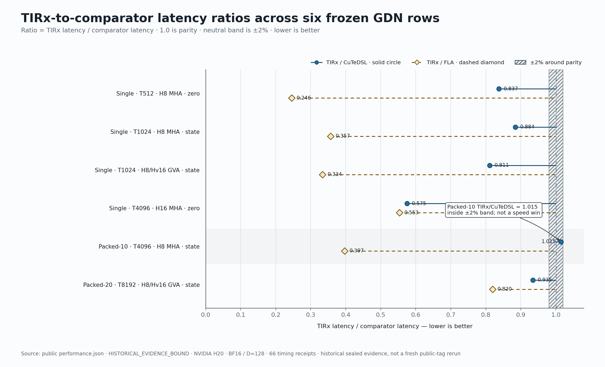
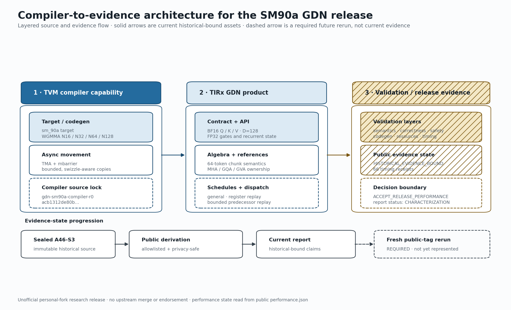

# TIRx on Hopper: SM90a compiler support and a productized GDN prefill operator

[](https://github.com/Aharrypotter/gdn-sm90a-tirx-report/actions/workflows/verify.yml)

This repository is the public evidence, reproduction, and writing hub for an
unofficial personal-fork experiment:

1. add the compiler primitives needed by TIRx on Hopper `sm_90a`;
2. build a public GDN prefill operator on top of those primitives;
3. compare the frozen operator with an exact CuTeDSL snapshot and the official
   FLA Triton implementation on NVIDIA H20.

The first evidence bundle is deliberately labelled
`HISTORICAL_EVIDENCE_BOUND`.  It is a deterministic, privacy-safe derivation
from an immutable 380-file release seal, but it is **not** represented as an
independent rerun from the newly published Git tags.  A fresh public-tag rerun
has its own gate and will be published separately.

## Frozen source coordinates

- [TVM compiler fork](https://github.com/Aharrypotter/tvm/tree/gdn-sm90a-compiler-r0)
- [TIRx kernels fork](https://github.com/Aharrypotter/tirx-kernels/tree/gdn-sm90a-kernel-r0)
- [CuTeDSL comparator fork](https://github.com/Aharrypotter/cuLA/tree/gdn-sm90a-comparator-r1)
- [FLA comparator](https://github.com/fla-org/flash-linear-attention/commit/d1ce07369d581813553f30a750af3b6b5f9af6a9)

No upstream pull request was created.  The branches and tags above are
unofficial personal-fork artifacts.

An earlier `gdn2-sm90a-comparator-r0` tag is retained immutably but is not
evidence for this report: every historical CuTeDSL receipt names
`cula.gdn.prefill.chunk_gated_delta_rule`, which is exactly bound by the
corrected `gdn-sm90a-comparator-r1` tag.

## Claim boundary

The measured scope is six BF16, head-dimension-128 GDN prefill rows on one
NVIDIA H20 target.  Five rows are faster than the frozen CuTeDSL comparator;
the packed-10 row is 1.46% slower and remains inside the preregistered ±2%
noise band.  This is not a claim about every Hopper GPU, every GDN shape, or
end-to-end model throughput.

Repository navigation, exact commands, reports, figures, and publication
drafts are available below.

## Read the release

- [Architecture and evidence chain](docs/architecture.md)
- [Compiler capability boundary](docs/compiler-capability.md)
- [GDN semantic contract](docs/gdn-semantics.md)
- [Schedules and exact dispatch](docs/schedules-and-dispatch.md)
- [Validation layers](docs/validation.md)
- [Benchmark methodology](docs/benchmark-methodology.md)
- [Evidence provenance](docs/evidence-provenance.md)
- [Limitations](docs/limitations.md)
- [Reproduction guide](reproduce/README.md)
- [Generated historical performance report](reports/historical-performance.md)







The figures are generated directly from the canonical public JSON. Their
contracts, palette, source fields, and QA record are in the
[chart map](assets/figures/chart-map.md).

## Reproduce and verify

The public reproduction scaffold checks exact source tags, builds TVM
out-of-tree without editable installs, runs CPU semantic gates, and provides a
fresh-process H20 benchmark harness:

```bash
make verify-all
python3 reproduce/checkout_public_sources.py --help
python3 -m reproduce.benchmark.contract --help
```

The fresh H20 run is deliberately a separate evidence root. Until that run is
complete and sealed, the performance package in this commit remains
`HISTORICAL_EVIDENCE_BOUND`.

## Publication package

Source templates live in [`content/`](content/). Canonical claims are
materialized into ready-to-copy drafts in [`dist/content/`](dist/content/) by:

```bash
python3 scripts/materialize_publication_content.py
python3 scripts/materialize_publication_content.py --check
```

The [publishing order](releases/publishing-order.md), [platform
checklist](releases/platform-checklist.md), and [correction
protocol](releases/rollback-and-corrections.md) keep downstream posts bound to
the same evidence and caveats.
