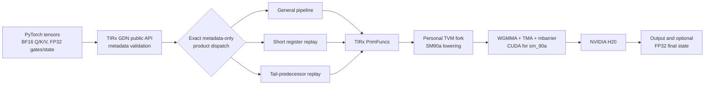

# Architecture

This release is a layered experiment, not a single standalone kernel.  A
bounded SM90a compiler slice in a personal TVM fork lowers a productized GDN
prefill operator from TIRx.  The operator owns its recurrence, packed-sequence
semantics, schedules, dispatch, and public PyTorch-facing API.

> Evidence status: the original numbers remain
> `HISTORICAL_EVIDENCE_BOUND`. A separate exact-public-tag H20 run is published
> as `CHARACTERIZATION`. The two bundles and their aggregates remain distinct.
> See [evidence provenance](evidence-provenance.md).

## Layer ownership

| Layer | Responsibility | Frozen source |
|---|---|---|
| Compiler | Target qualification, WGMMA tile lowering, TMA/TensorMap handling, layouts, bounded copies, host codegen | [TVM commit `acb1312…`](https://github.com/Aharrypotter/tvm/commit/acb1312de80b39340e09b0aaad818ff029e745d6) |
| Semantic contract | BF16/FP32 shapes, head mapping, recurrence, chunk algebra, precision-visible ordering, packed isolation | [contract.py](https://github.com/Aharrypotter/tirx-kernels/blob/90c9c62c84ecc452dd86602f0ea49a625845045c/tirx_kernels/attention/_gdn_sm90/contract.py), [reference.py](https://github.com/Aharrypotter/tirx-kernels/blob/90c9c62c84ecc452dd86602f0ea49a625845045c/tirx_kernels/attention/_gdn_sm90/reference.py) |
| Product implementation | General, register-replay, and tail-predecessor schedules | [runtime commit `90c9c62…`](https://github.com/Aharrypotter/tirx-kernels/commit/90c9c62c84ecc452dd86602f0ea49a625845045c) |
| Public API and dispatch | Input validation, SM90 capability check, exact route selection, compilation cache, output allocation | [api.py](https://github.com/Aharrypotter/tirx-kernels/blob/90c9c62c84ecc452dd86602f0ea49a625845045c/tirx_kernels/attention/_gdn_sm90/api.py) |
| Validation | Historical full gate ladder plus a separate public-tag timing characterization | [historical evidence](../evidence/historical/gdn-sm90a-h20-20260728-v1/), [fresh evidence](../evidence/fresh/gdn-sm90a-public-tags-h20-20260729-v1/) |

The compiler and kernel repositories are intentionally separate.  The
compiler layer provides reusable mechanisms; it does not know the GDN
recurrence or performance schedule.  The kernel layer selects and composes
those mechanisms but does not silently call FLA, Triton, CuTeDSL, or a C++
extension.

## Runtime flow

1. The public wrapper validates tensor type, CUDA placement, rank, contiguity,
   alignment, head relationships, and optional-state shape from host-visible
   metadata.
2. `cu_seqlens` values remain device-resident on the default path.  The caller
   is responsible for valid, strictly increasing, non-empty boundaries.
3. Dispatch uses only the specialization key
   `(tokens, sequences, Hq, Hk, Hv, initial-state, final-state)` plus the
   presence of `alpha` and `beta`.
4. An exact allowlisted key may select a specialized schedule.  Every
   non-allowlisted shape or optional-argument combination uses the general
   TIRx pipeline.
5. TIRx compiles the selected PrimFunc tuple for `sm_90a` through the personal
   TVM fork.  No route has an external implementation fallback.
6. The public output is BF16.  The optional recurrent state is FP32 in
   `[sequence, output_head, V, K]` orientation.

## Frozen source coordinates

- Compiler: tag
  [`gdn-sm90a-compiler-r0`](https://github.com/Aharrypotter/tvm/tree/gdn-sm90a-compiler-r0),
  commit
  [`acb1312de80b39340e09b0aaad818ff029e745d6`](https://github.com/Aharrypotter/tvm/commit/acb1312de80b39340e09b0aaad818ff029e745d6).
- Kernel: tag
  [`gdn-sm90a-kernel-r0`](https://github.com/Aharrypotter/tirx-kernels/tree/gdn-sm90a-kernel-r0),
  release commit
  [`12ce3721f7c62c5fbd911103ae373de689e58385`](https://github.com/Aharrypotter/tirx-kernels/commit/12ce3721f7c62c5fbd911103ae373de689e58385),
  exact runtime commit
  [`90c9c62c84ecc452dd86602f0ea49a625845045c`](https://github.com/Aharrypotter/tirx-kernels/commit/90c9c62c84ecc452dd86602f0ea49a625845045c).
- CuTeDSL comparator: corrected tag
  [`gdn-sm90a-comparator-r1`](https://github.com/Aharrypotter/cuLA/tree/gdn-sm90a-comparator-r1),
  exact commit
  [`88737e9d906cf313995a092624656a89d74dd65e`](https://github.com/Aharrypotter/cuLA/commit/88737e9d906cf313995a092624656a89d74dd65e).
- FLA comparator: exact upstream commit
  [`d1ce07369d581813553f30a750af3b6b5f9af6a9`](https://github.com/fla-org/flash-linear-attention/commit/d1ce07369d581813553f30a750af3b6b5f9af6a9).

All three fork tags are unofficial personal research artifacts.  No upstream
pull request, merge, or endorsement is implied.
